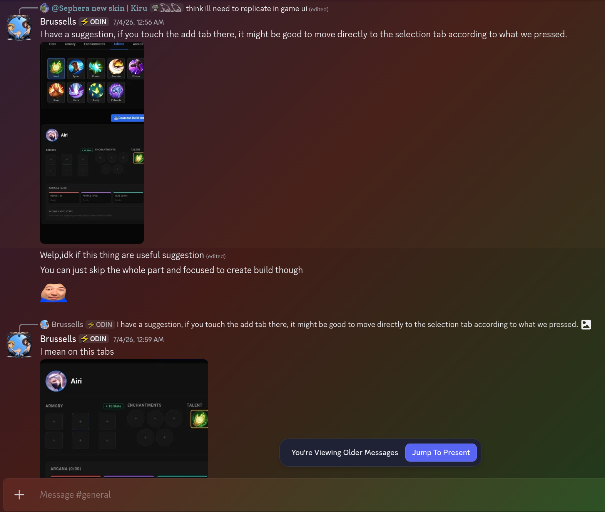
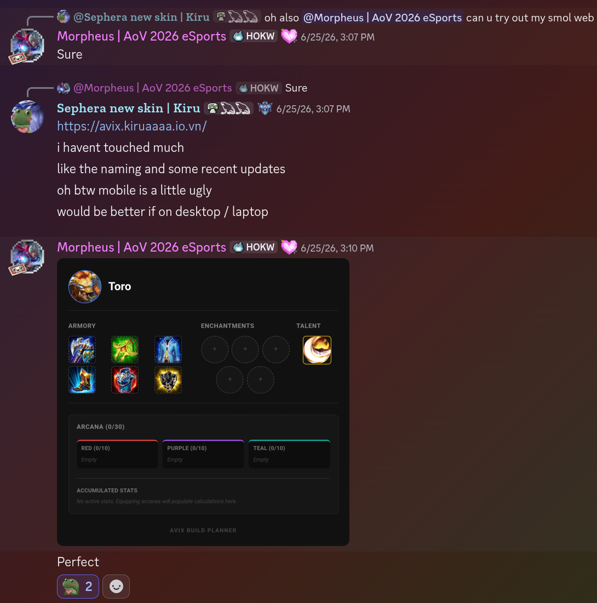
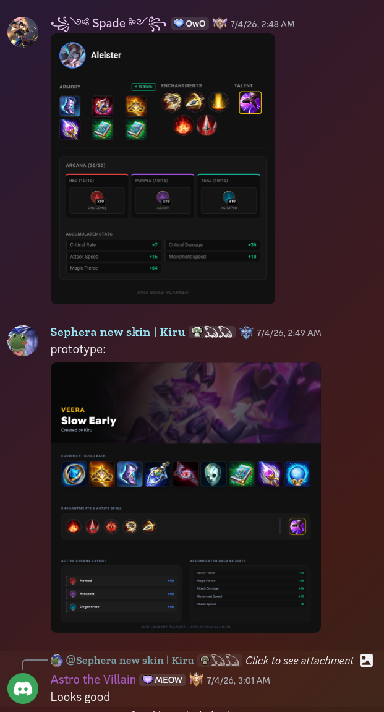

AVIX.

1. Backend: For now it's just a static site hosted on GitHub Pages, so only JavaScript is used. Data is stored in JSON files.

2. DevOps: (my main focus)
   Topics explored include:

- Git
- GitHub
- GitHub Pages
- GitHub Actions
- Cloudflare
- CI/CD pipelines
- Semantic Versioning (SemVer)
- Conventional Commits
- Branching strategies
- Release management
- Issue tracking
- Pull Request workflows
  Although I am currently the sole developer, I intentionally follow collaborative development practices to build habits that transfer naturally into professional team environments.

---

## AI-assisted Workflow

AI is an important part of this project—but not the project itself.
I use multiple AI tools, namely:

- ChatGPT: Ideas container, I like its Project feature
- Deepseek: Repetitive tasks with huge context windows, such as updating JSON files or summarizing Git diffs
- Google AIStudio: Main implementation, actually build the codes
- Antigravity CLI: For automating repetitive tasks straight into local files

Implementation is heavily AI-assisted, allowing me to focus on defining AoV's logic and mechanics in details, and gradually becoming more comfortable with Svelte/SvelteKit.
The objective is not to replace engineering with AI, but to learn how modern software engineers can effectively collaborate with AI while retaining ownership of technical decisions.

---

## Inspiration

AVIX would not exist without inspiration from existing projects and interfaces. Which are:

- Arena of Valor's in-game interface
- OADex (currently down for now, sad)

---

## Contributing

Contributions are always welcome.
Either DM me on Discord (@kiruaaaa) or ping me in AoV's Discord server

### Developers

- GitHub Issues
- Pull Requests
- Discussions

### Players

Most users are players rather than developers, so GitHub may not be the most comfortable platform.

If you're unfamiliar with Git or GitHub, the easiest way to contribute is simply by:

- use AVIX and tell me what you think
- reporting bugs
- suggesting features
- discussing UI improvements

through Discord.

Every piece of feedback helps improve AVIX.

