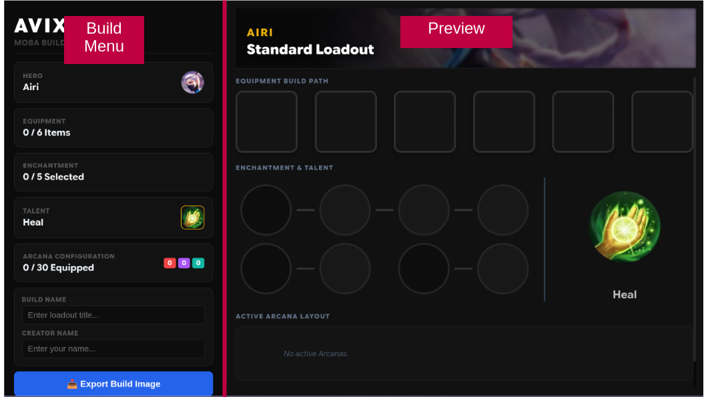
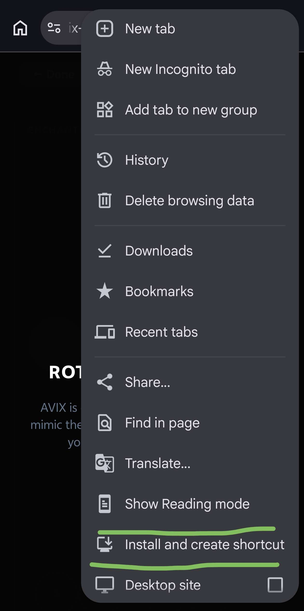
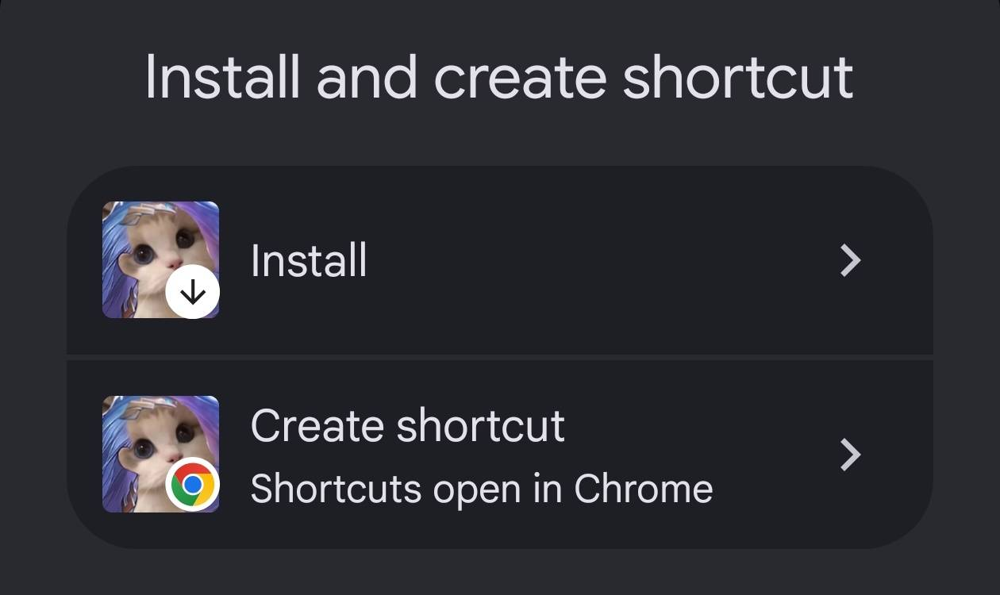

# Welcome to AVIX

Hi, this is Kiru, creator of AVIX (Arena of Valor IndeX) 👋🏻

AVIX is a web app to create & share **Arena of Valor** builds outside the game.

> ⚠️ AVIX is still in active development. Expect frequent updates, UI changes, and experimental features.

---

## How to use

- For laptop and desktop:
  - Go to <https://avix.kiruaaaa.io.vn/>
  - Zoom in (Ctrl+Plus) a few times for better experience
    
  - Try the app

- Mobile: You will need to install the web as a PWA with the following steps:
  - Go to <https://avix.kiruaaaa.io.vn/>
  - Tap the three dots in the top right corner
  - Tap "Add to Home Screen" or "Install"
    
  - If a menu pops up, tap "Install" (this way, the URL box will disappear)
    
  - Rotate to landscape mode and try the app

---

## Learning Goals

Beyond being a game tool, AVIX is also my personal engineering sandbox.

Instead of building many small demo projects, I'd rather keep improving one real app while learning modern software engineering practices.

Through AVIX, I'm practicing and exploring:

- DevOps: Git/GitHub, Cloudflare
- FE: Svelte/SvelteKit, TypeScript (hopefully 😅)
- BE: Currently none (AVIX is a fully static site)
- AI-assisted software development
- Programming practices: Conventional Commits, Semantic Versioning (SemVer)

- Discord: Community management and deployment notifications via GitHub Actions

### About AI-assisted Workflow

AI is an important part of this project—but it isn't the project itself.
I use multiple AI tools, namely:

- ChatGPT: Brainstorming, project planning (I like its Project feature, keeps things together)
- Deepseek: Repetitive tasks, such as generating JSON files
- Google AI Studio: Main implementation while learning Svelte/SvelteKit
- Antigravity CLI: Automating repetitive local development tasks

Implementation is heavily AI-assisted, allowing me to focus on AoV mechanics, product direction, architecture, and continuous learning.

The goal isn't to replace software engineering with AI, but to learn how modern engineers can effectively collaborate with AI while retaining ownership of technical decisions.

---

## Contact, Community and Contributing

### Contact

Discord is the easiest way to reach me.
You can find me as **@kiruaaaa**, or through [my Discord profile link](https://discord.com/users/703433100520325290)

### Community

I'd love to discuss AVIX together with the community!

You can find me in:

- [My personal Discord server](https://discord.com/invite/2B2tUCtg4u) (EN/VN)
- [Arena of Valor Discord server](https://discord.gg/arenaofvalor) (EN)

### Contributing

Contributions are **very, very welcome** :3

AVIX is still evolving rapidly, so things may change often. Even if I can't implement your idea immediately, every suggestion helps shape the project.

#### For Players

You absolutely **don't need to know programming** to contribute.

Since AoV doesn't provide a public API, community knowledge is incredibly valuable.

You can help by:

- Reporting bugs or unexpected behavior
- Suggesting new features or QoL improvements
- Designing icons, banners, or other visual assets
- Providing screenshots from the game
- Helping transcribe in-game data into AVIX
- Explaining hero skills, mechanics, and game interactions
- Verifying damage formulas or gameplay mechanics
- Proofreading the data that comes from the game
- Helping translate the interface
- Discussing whether AVIX accurately reflects in-game mechanics
- Simply using AVIX and telling me what feels good—or what doesn't

Every bit of feedback is appreciated.

#### For Developers

I'd be thrilled to receive contributions from other developers!

Frontend developers are especially welcome, since most of the project currently lives on the frontend.
That said, I'm in the middle of a fairly large architecture refactor, so development may be messy for a while.

If you'd like to contribute code, I'd recommend reaching out first so we can discuss ideas and avoid duplicated work.

Contributions of all kinds are appreciated, including:

- UI/UX improvements
- Performance optimizations
- Accessibility
- Documentation
- Refactoring
- Testing
- Build tooling
- CI/CD improvements
- Developer experience

## Community Feedback

Some early feedback from the players:

